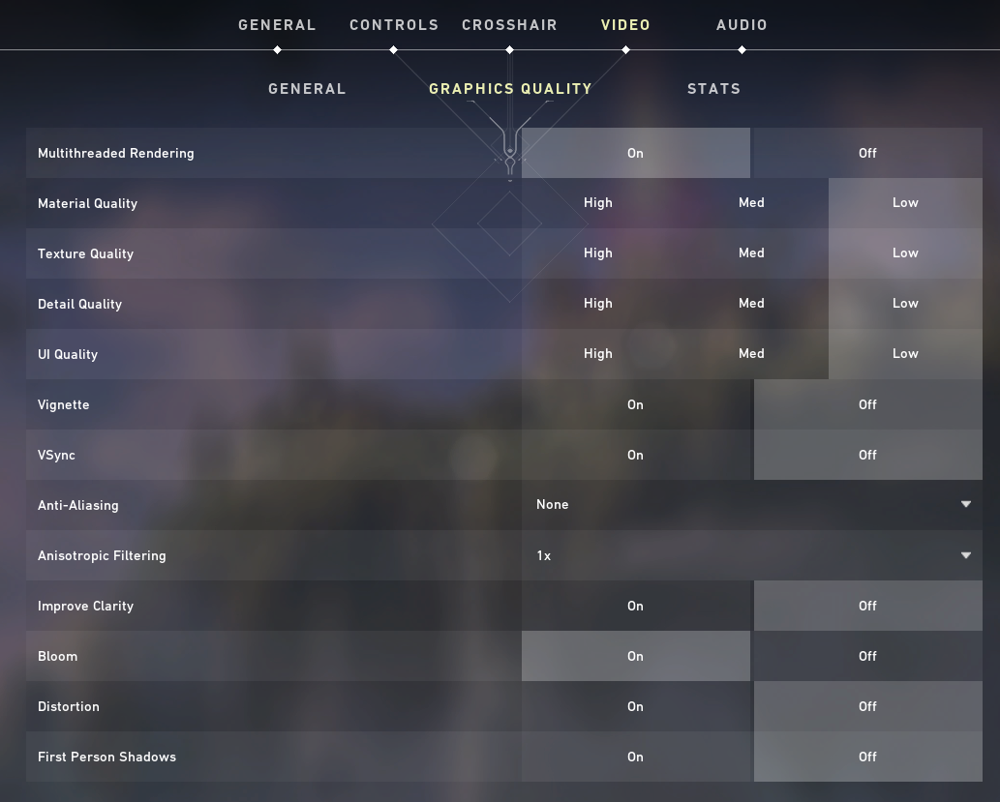

# OCR Statistics Recorder

This project is intended for people who play Riot Games' tactical shooter, Valorant. The program records the user's score into a file when practicing in the "Shooting Range" to keep track of the user's overall improvement in the Range.

## Requirements

* Windows 10/11
* Ability to change windows when in-game (Alt+Tab)

## Installation

1. Download the source code as a zip file from [here](https://github.com/BennyExtreme/ocr-stats-recorder/archive/refs/heads/master.zip)

2. Unzip the file

3. Setup a Python virtual enviroment using the venv module
   
   * Open a terminal window
   
   * Create: `py -m venv venv`
   
   * Enter: `venv\Scripts\activate`
   
   * Upgrade: `python.exe -m pip install --upgrade pip`
   
   * Install required libraries: `pip install -r requirements.txt`
   
   > [!NOTE]  
   > You can avoid creating the virtual enviroment manually by opening [venv.bat](https://github.com/BennyExtreme/ocr-stats-recorder/blob/master/venv.bat).

4. Install tesseract from [here](https://github.com/UB-Mannheim/tesseract/wiki#tesseract-installer-for-windows)
   
   > [!IMPORTANT]  
   > During the installation process take note of the installation path and make sure it is the same as written [here](https://github.com/BennyExtreme/ocr-stats-recorder/blob/master/constants.py#L2) otherwise you will encounter an error and the program will be closed.

## Usage

1. Start VALORANT

2. Navigate to the Shooting Range (Play > Practice > Shooting Test > Enter Range)

3. Start [range_recorder.py](https://github.com/BennyExtreme/ocr-stats-recorder/blob/master/range_recorder.py)
   
   * Open a terminal window
   
   * Enter the virtual enviroment: `venv\Scripts\activate`
   
   * Start the script: `py range_recorder.py`
   
   > [!NOTE]  
   > You can avoid starting the script manually by opening [start.bat](https://github.com/BennyExtreme/ocr-stats-recorder/blob/master/start.bat).
   > 
   > You can also create a shortcut of that file on the Desktop so that you can conveniently open the script.

4. Wait for program to output `RANGE RECORDER HAS STARTED!`

5. Start practicing with the speed of your choice! Range scores for the day are recorded in `output_files/scores.csv` while the recorder window is open.
   
   * You only have to run the program once for multiple trials.
   * Program does not currently work for the "Streak" mode and only works for the "Speed" mode (shoot 30 bots on easy, medium, or hard)

6. To exit out of the recorder, press 'ESC' before/after shooting the "START" button in-game.

Overall scores are saved in `output_files/_allscores.csv`

## Concepts Used

* Optical character recognition ([OCR](https://en.wikipedia.org/wiki/Optical_character_recognition))
* HSV color detection

## Future Plans

* Improve accuracy of reading the scoreboard
* Add customized options for the program to work with the user's display settings (i.e. colorblind options)
* Track overshooting/undershooting when aiming at the bots; could help users improve their aim
* Have program able to work for different challenges (streak mode)
* Read and record difficulty of range
* Record what gun is being used

## Bugs

* The recorder might not work depending on the game's color intensity since the program relies on color detection. A new version is being created to account for these differences, but in the meantime, the graphics settings that work with the program are shown here. 

